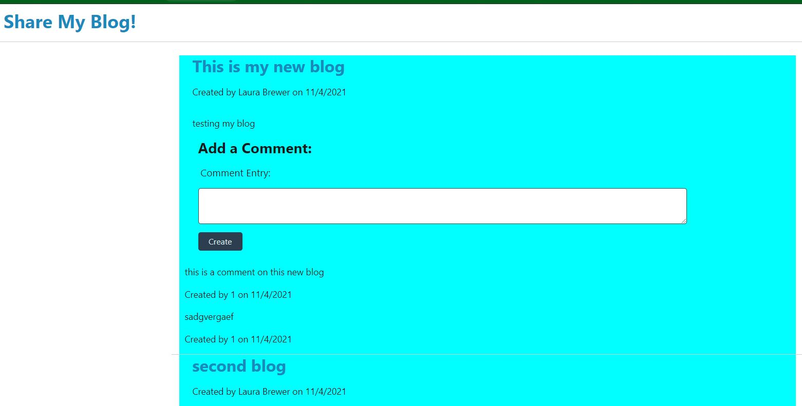

-----------------------------------------

## Table of Contents

* [Title](#Title:)
* [User Story](#User-Story)
* [Acceptance Criteria](#Acceptance-Criteria)
* [Link to Application](#Link-to-Application)
* [Link to GitHub repository](#Link-to-GitHub-repository)
* [picture of page](#picture-of-page:)

-----------------------------------------
###Title:

# TechBlog--CMS-style blog site

----------------------------------------------
## User Story

```md
As A developer who writes about tech I WANT a CMS-style blog site
SO THAT I can publish articles, blog posts, and my thoughts and opinions.
```
----------------------------------------------------------------
## Acceptance Criteria

```md
GIVEN a CMS-style blog site when the site is visited the first time, it presents the homepage, which includes existing blog posts if any have been posted and any comments; and the option to log in.  Once logged in you are presented with your dashboard page to enter new blogs if you wish; it also has navigation links for the homepage and the dashboard; and the option to log out.

The homepage option takes you to the homepage. WHEN I click on the dashboard option in the navigation then I am taken to the dashboard and presented with any blog posts I have already created and the option to add a new comment.

The logout logs the user out.
Click on login to either login or choose to sign up. On the sign page you are prompted to create a username and password, and the user credentials are saved and user is logged into the site.

When revisiting the site and choosing to sign in, I am prompted to enter my username and password. 

Signed in to the site I see navigation links for homepage, dashboard, and the option to log out.

Click on the homepage option in the navigation, then you are taken to the homepage and presented with existing blog posts that include the post titles, the dates created, and any comments that exist and the option to enter new comments.

WHEN I click on an existing blog post it presents with the post title, contents, post creator’s username, and date created for that post and any comments.

To enter a comment, on the homepage enter your comment and then on the create button while signed in, then the comment is saved and the post is updated to display the comment, the comment creator’s id, and the date created.

WHEN I click on the dashboard option in the navigation then I am taken to the dashboard and presented with any blog posts I have already created and the option to add a new blog or delete them. When creating a new blog post 
I am prompted to enter both a title and contents for my blog post. WHEN I click on the button to create a new blog post, the title and contents of my post are saved and I am taken back to an updated dashboard that shows all my blog posts. WHEN I use the delete button on one of my existing posts in the dashboard and taken back to an updated dashboard.


```
-------------------------------------------------------------------------------
### Link to Application

https://still-fjord-12611.herokuapp.com/

--------------------------------------------------------------------------------
### Link to GitHub repository 

https://github.com/ljbrewer/TechBlog

--------------------------------------------------------------------------------
### picture of page:

